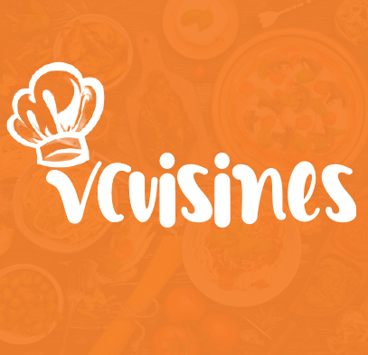

# VCuisines

Ứng dụng ẩm thực Việt Nam - Tìm kiếm và nấu ăn tại nhà một cách dễ dàng

## Chức Năng: 

- Tạo tài khoản
Tạo tài khoản trong VCuisines và khám phá những món ăn đặc sắc của Việt Nam
- Tìm kiếm món ăn
Tìm và làm món ăn mà bạn thích ngay tại nhà
- Lưu lại danh sách những món ăn mà người dùng yêu thích
Lưu và hiển thị lại những món ăn mà người dùng yêu thích
- Hiển thị thông tin món ăn, nguyên liệu chế biến, cách chế biến chi tiết cho từng món ăn
Hiển thị đầy đủ thông tin của món ăn khi người dùng chọn vào xem món ăn
- Bình luận về món ăn đó 
Cho phép người dùng bình luận về món ăn, hiển thị thông tin bình luận

## Yêu Cầu Thiết Bị

- iOS 13+ / macOS 10.15+ / watchOS 6+ / tvOS 13+
- Xcode 11.0+
- Swift 5+
- Android (không yêu cầu - 7+)

## Thư viện và công nghệ

- flutter_svg: ^0.22.0
- provider: ^5.0.0
- bottom_navy_bar: ^6.0.0
- firebase_core: ^1.2.0
- firebase_auth: ^1.2.0
- google_sign_in: ^5.0.4
- firebase_storage: ^8.1.0
- cloud_firestore: ^2.2.0
- flutter_facebook_auth: ^3.4.1
- flutter_spinkit: ^5.0.0
- smooth_star_rating: ^1.1.1
- like_button: ^2.0.2
- fluttertoast: ^8.0.7
- rflutter_alert: ^2.0.2
- uuid: ^3.0.4
- image_picker: ^0.8.1+1
- timeago: ^3.1.0
- shared_preferences: ^2.0.6
- flutter_launcher_icons: ^0.9.0

## Project Developer

- Nguyễn Thành Hiếu 
- Trần Quốc Khánh
- Nông Ngọc Xuân Hoàng

## License

VCuisines is released under the Apache License 2.0. Copyright [2021] [See LICENSE](https://github.com/KSB-tqk/Vcusines/blob/master/LICENSE) for details

